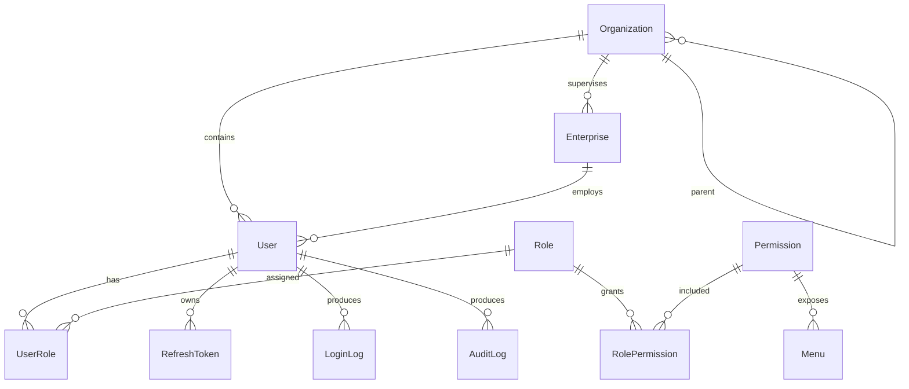

# 无人快递车监管平台 Phase 1 蓝图

## 1. 业务功能矩阵

| 业务域 | 管理端能力 | 企业端能力 | Phase 1 落地 | 后续阶段 |
| --- | --- | --- | --- | --- |
| 监管总览 | 全市企业、车辆、风险、待办和地图态势 | — | 登录后监管首页、权限视域 | Phase 4–6 接入实时业务指标与地图 |
| 运行监管 | 实时运行、车辆分布、轨迹、记录、在线监测、运行区域 | 本企业实时车辆、轨迹、在线情况、运行记录 | 菜单与权限模型 | Phase 4 |
| 安全监管 | 告警、事故、违规、围栏、离线、应急 | 本企业告警、事故上报、违规、应急、整改 | 菜单与权限模型 | Phase 5 |
| 准入与审批 | 企业入驻、路测、审批任务、牌照、续期 | 入驻、路测、我的申请、牌照、续期 | 菜单与权限模型 | Phase 3 |
| 监管档案 | 企业档案、车辆档案、车辆、厂商、车型 | 我的车辆、车辆档案、企业信息与资质 | 企业主体基础数据 | Phase 2 |
| 分析研判 | 运行分析、安全态势、事故回溯、企业评价、安全画像、报表 | 当前评价、历史评价、申诉复核 | 菜单与权限模型 | Phase 6 |
| 系统管理 | 用户、角色、组织、企业账号、权限菜单、字典、参数、日志 | 企业用户、个人中心 | 真实认证、RBAC、数据权限、用户/角色/组织/企业账号、日志 | Phase 7 完整联调 |

## 2. 信息架构与路由

结构按监管任务与操作频率组织，不照搬需求文档章节。独立业务目标使用独立路由；Tab 只用于同一对象的局部视图。

### 管理端

```text
监管总览                  /regulatory/overview
运行监管                  /operations/*
  实时运行                /operations/live
  车辆分布                /operations/distribution
  车辆轨迹                /operations/tracks
  运行记录                /operations/records
  在线监测                /operations/online
  运行区域                /operations/areas
安全监管                  /safety/*
准入与审批                /admission/*
监管档案                  /archives/*
分析研判                  /analytics/*
系统管理                  /system/*
  用户管理                /system/users
  角色管理                /system/roles
  组织机构                /system/organizations
  企业账号                /system/enterprise-accounts
  日志审计                /system/audit-logs
```

### 企业端

```text
企业首页                  /enterprise/overview
运行管理                  /enterprise/operations/*
车辆管理                  /enterprise/vehicles/*
申请与许可                /enterprise/applications/*
安全管理                  /enterprise/safety/*
企业档案                  /enterprise/profile/*
企业评价                  /enterprise/evaluations/*
账号管理                  /enterprise/accounts/*
```

## 3. 角色权限矩阵

| 角色 | 门户 | 数据范围 | 系统用户 | 角色授权 | 组织机构 | 企业账号 | 监管 API | 企业 API |
| --- | --- | --- | --- | --- | --- | --- | --- | --- |
| 超级管理员 | 管理端 | 全部 | 管理 | 管理 | 管理 | 管理 | 允许 | 按需 |
| 监管管理员 | 管理端 | 所辖组织 | 管理 | 管理 | 查看/维护 | 管理 | 允许 | 禁止 |
| 监管工作人员 | 管理端 | 所辖组织 | 查看 | 查看 | 查看 | 查看 | 允许 | 禁止 |
| 审批人员 | 管理端 | 所辖组织 | 禁止 | 禁止 | 查看 | 查看 | 允许 | 禁止 |
| 企业管理员 | 企业端 | 本企业 | 本企业用户 | 禁止 | 禁止 | 本企业 | 禁止 | 允许 |
| 企业普通用户 | 企业端 | 本企业授权数据 | 禁止 | 禁止 | 禁止 | 禁止 | 禁止 | 允许 |

权限以数据库中的 `Permission`、`RolePermission`、`Menu.permissionCode` 为准；前端菜单只是展示结果，API Guard 才是授权边界。

## 4. 技术架构

```text
Vue 3 + TypeScript + Vite + Router + Pinia + Element Plus
                       │ REST / Bearer JWT
NestJS + ValidationPipe + JWT Guard + Permission Guard + DataScope
                       │ Prisma ORM
                    SQLite
```

- Access Token 短时有效；Refresh Token 的摘要和失效时间持久化。
- 密码使用 bcryptjs 哈希，数据库不保存明文。
- 全局响应结构为 `code/message/data/timestamp/requestId`。
- 业务写操作进入 `AuditLog`，认证结果进入 `LoginLog`。
- `organizationId` 与 `enterpriseId` 构成数据权限基础；企业接口强制以当前用户企业为范围。
- Prisma Service 不使用 SQLite 专属 SQL，便于后续迁移 PostgreSQL/MySQL。

## 5. ER 设计



核心实体均使用字符串主键、唯一业务编码、创建/更新时间与状态字段；连接表使用联合唯一键和外键。删除优先使用状态停用，审计记录不级联删除。

## 6. API 模块规划

| 模块 | 路径 | 关键接口 |
| --- | --- | --- |
| 认证 | `/api/auth` | `login`、`refresh`、`logout`、`me`、`menus`、`change-password` |
| 用户 | `/api/system/users` | 分页查询、新增、修改、启停 |
| 角色 | `/api/system/roles` | 查询、新增、修改、权限授权 |
| 权限 | `/api/system/permissions` | 权限目录查询 |
| 组织 | `/api/system/organizations` | 组织树查询、新增、修改 |
| 企业 | `/api/system/enterprises` | 分页查询、新增、修改 |
| 日志 | `/api/system/logs` | 登录日志、审计日志 |
| 监管边界 | `/api/regulatory` | 仅监管权限可访问的概览验证 |
| 企业边界 | `/api/enterprise` | 自动限定当前企业的数据验证 |

## 7. Phase 1 关键状态与恢复

- 登录：空闲 → 提交中 → 成功进入对应门户；凭证错误保留账号输入并显示字段级提示。
- Token：Access Token 失效时只允许一次刷新；刷新失败清理会话并回到登录页。
- 用户：启用/停用由后端校验；当前用户不可停用自己；写入成功后刷新列表仍存在。
- 角色授权：保存前展示权限集合；保存成功写审计日志；用户重新登录后菜单随权限变化。
- 数据权限：企业用户访问监管 API 返回 403；企业接口忽略客户端提交的其他企业 ID。

## 8. 可追踪性说明

本蓝图依据《无人快递车监管平台需求说明书 V1.0》和用户提供的 Phase 1 开发说明。当前无真实组织访谈、可用性测试或生产接口数据；菜单与角色边界属于已给定业务约束，界面细节将在浏览器与 Playwright 验收中验证。
